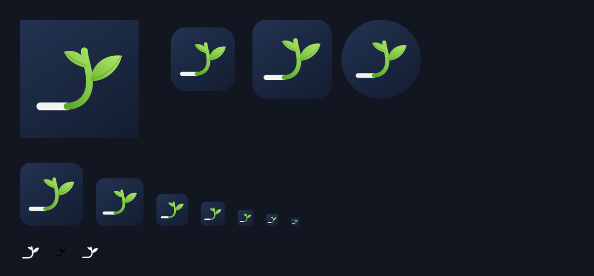

# fukura



fukuraは、短いトリガーから定型文をすばやく入力できる、ローカルファーストの入力支援アプリです。

macOS / Windowsではメニューバー・タスクトレイに常駐し、iPhone / iPad / Androidではカスタムキーボードとして動作します。

> Status: 初回公開に向けて準備中です。ストア版・署名済みバイナリは公開後にGitHub Releasesから案内します。

## 特長

- `;mail` のような短いトリガーから定型文を展開
- macOS、Windows、iPhone / iPad、Androidに対応
- アプリ内で追加・編集・削除・有効/無効を管理
- 複数行の定型文に対応
- 共通の `snippets.json` をインポート・書き出し
- 入力履歴や辞書を外部サーバーへ送信しない
- アカウント登録、広告SDK、解析SDK、ネットワーク同期なし

## プライバシー

辞書は端末内に保存されます。詳しくは [PRIVACY.md](PRIVACY.md) を参照してください。

- macOS: `~/Library/Application Support/fukura/`
- Windows: `%LOCALAPPDATA%\fukura\`
- iOS: App Group共有コンテナ
- Android: アプリ専用内部ストレージ

## リポジトリ構成

```text
android/   Android App + InputMethodService
ios/       iOS App + Keyboard Extension
macos/     AppKitメニューバーアプリ
windows/   .NET 8 Windows Formsアプリ
shared/    snippets.jsonの共通ロジックとSchema
examples/  サンプル辞書
tests/     共通ロジックのテスト
docs/      手動テストと公開資料
```

## 開発

### 共通テスト

```bash
node --test tests/*.test.mjs
```

### macOS

macOS 13以降とSwift 5.9以降が必要です。

```bash
cd macos
swift build
swift run FukuraMac
```

入力展開にはAccessibilityとInput Monitoringの許可が必要です。

### Windows

Windows 10 / 11と.NET 8 SDKが必要です。

```powershell
dotnet build windows/FukuraWindows.csproj
```

### Android

JDK 17、Android SDK、Gradle 8系が必要です。

```bash
gradle -p android assembleDebug
```

### iOS

Xcode 26とXcodeGenが必要です。

```bash
brew install xcodegen
ios/generate-project.sh
open ios/Fukura.xcodeproj
```

実機配布ではTeam、App ID、App Groups、署名を自身のApple Developerアカウントへ合わせてください。

## 辞書形式

```json
{
  "version": 1,
  "snippets": [
    {
      "id": "mail",
      "trigger": ";mail",
      "body": "your.name@example.com",
      "enabled": true
    }
  ]
}
```

詳細は [サンプル](examples/snippets.example.json) と [JSON Schema](shared/snippets-schema.json) を参照してください。

## コントリビューション

IssueやPull Requestを歓迎します。作業前に [CONTRIBUTING.md](CONTRIBUTING.md) と [CODE_OF_CONDUCT.md](CODE_OF_CONDUCT.md) を確認してください。

脆弱性は公開Issueではなく、[SECURITY.md](SECURITY.md) の方法で報告してください。

## ライセンス

ソースコードは [Apache License 2.0](LICENSE) で公開します。

`fukura`の名称、ロゴ、アプリアイコンなどのブランド資産は、このライセンスの対象外です。詳しくは [TRADEMARKS.md](TRADEMARKS.md) を参照してください。
